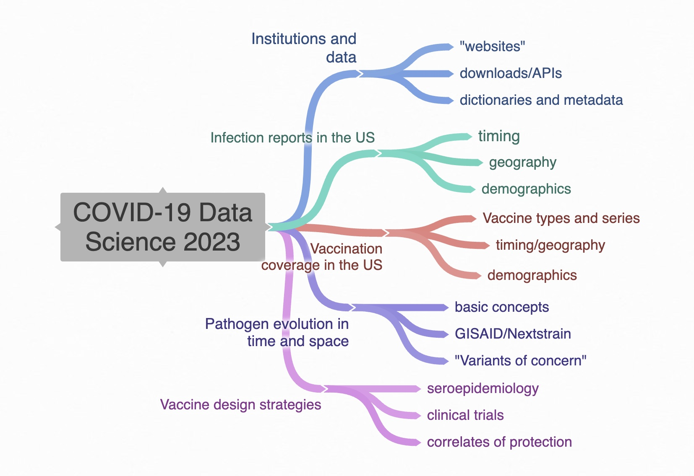

# teachCovidData

This R package for getting familiar with COVID-19 data resources and their use was
inspired by work of Dr. Latrice Landry related to the 
[NIH Covid Community Engagement Alliance (CEAL)](https://covid19community.nih.gov/).

Learning objectives

- get comfortable with acquiring and exploring public datasets using R
- look specifically at temporal and geographic variations in impacts of COVID
- produce questions and projects related to COVID effects and responses

A concept map of a full course:

Important topics are not addressed, but comments and pull requests are welcome;
see the [issues tracker](https://github.com/vjcitn/teachCovidData/issues).
It would be very nice to have modules on

- mobility metrics related to incidence variation
- environmental measures of population load, such as [wastewater monitoring results](https://data.cdc.gov/Public-Health-Surveillance/NWSS-Public-SARS-CoV-2-Wastewater-Metric-Data/2ew6-ywp6)
- types and effects of non-pharmacologic interventions
- [vaccination mandates](https://data.cdc.gov/Policy-Surveillance/State-Level-Vaccine-Mandates-All/kw6u-z8u2)
- incidence of vaccination-related adverse events
- elaborations of elements on data publication and education in international contexts

See the "get started" link on the vjcitn.github.io/teachCovidData site for current details.
