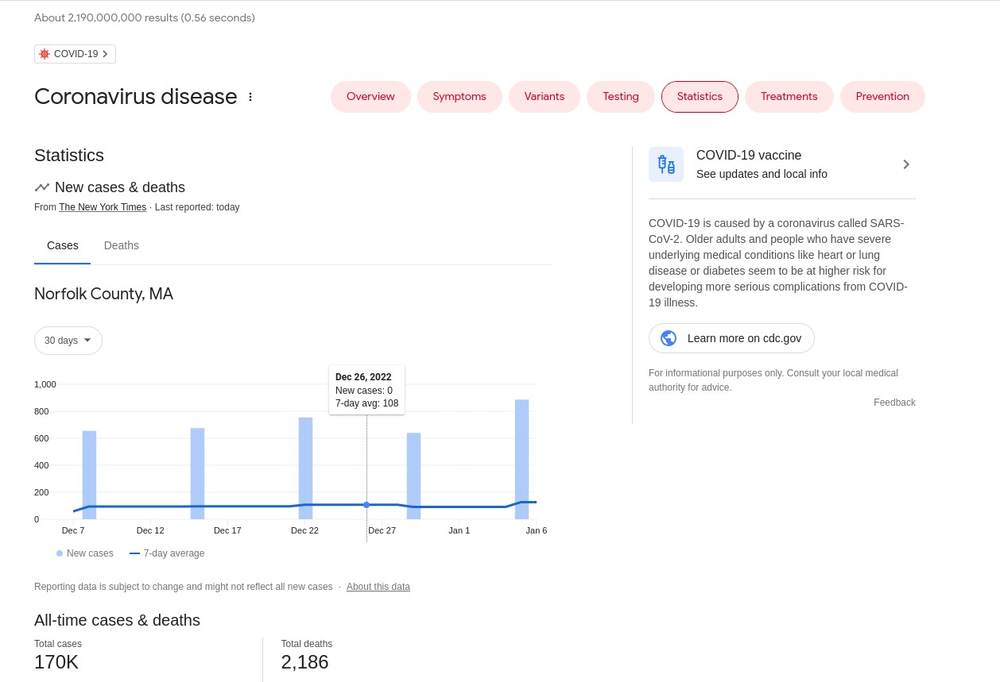
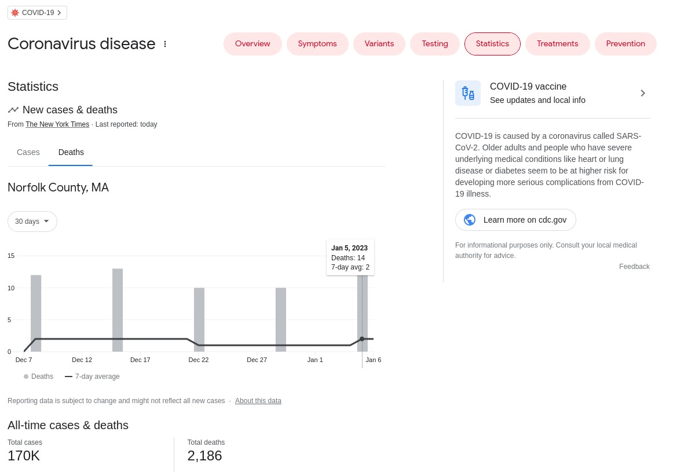
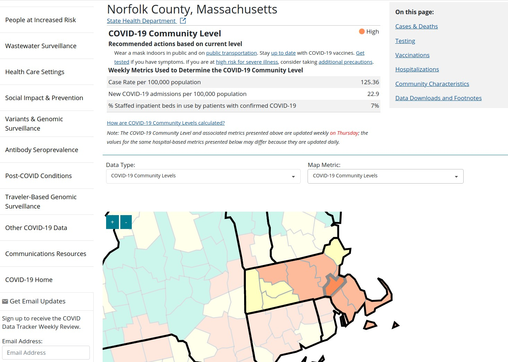
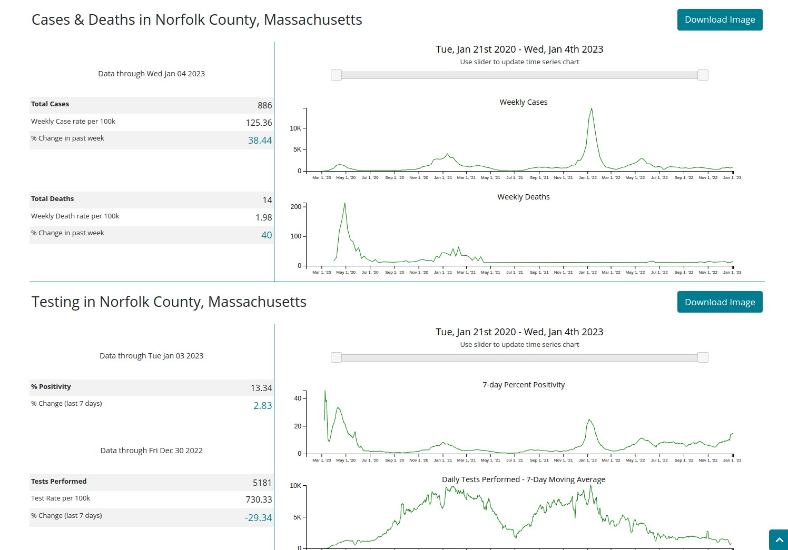

```{r setup, echo=FALSE, results="hide"}
suppressMessages({
suppressPackageStartupMessages({
library(teachCovidData)
library(ggplot2)
})
})
```

# Introduction

## Basic definitions

A website is an information source specified by a Uniform Resource Locator (URL).
See the [wikipedia entry](https://en.wikipedia.org/wiki/URL) for a good overview
of the URL concept.

The website concept has been transformative in our understanding and
practice of mass communication.

- Content added to the website with a given URL can be freely accessible, globally, to anyone
with a cell phone or computer who knows the URL.
- Indexing systems like Google make it easy for individuals to find web-published content of interest.
- Open production tooling makes it possible to produce website contents of various kinds, including texts,
audio segments, videos, data tables.

The approach taken to web authoring and consumption to date
appears to permit a high degree of 
[anonymity](https://en.wikipedia.org/wiki/Anonymity#Anonymity_on_the_Internet)
for both authors and consumers, leading to various controversies.  There are also
risks of bias in the operation of indexing systems that tilt search results
in unfair ways.  The topic of [search neutrality](https://en.wikipedia.org/wiki/Search_neutrality)
is worth investigation.

## On this web content

The teachCovidData package is made available on the web through the GitHub source
code management system, and uses the URL `https://github.com/vjcitn/teachCovidData`.

A basic purpose of teachCovidData is to collect together disparate web-based sources
of information on COVID-19, adding value through curation, software enhancement,
and openness, so that students are better equipped to learn, critique, and
ultimately teach important concepts about COVID-19 including concepts
related to data science and information technology that can directly impact
public health and the control of disease risks.

## Technical issues

### Hypertext

A basic insight underlying the web concerns the value of linking information
sources together.  Instead of repeating information or requiring a reader
to find a related source through bibliographic reference, 
a [hyperlink](https://en.wikipedia.org/wiki/Hyperlink) can be used to
provide an option to the reader to "visit" another source to obtain
more details or clarification of a word or phrase, or to "see" some other
aspect of the source content.  The "browser back button" allows return to
source.  Excursions from link to link are a common form of recreation 
and learning on the web.

The most basic form hypertext composition uses the Hypertext Markup Language 
([HTML](https://en.wikipedia.org/wiki/HTML)).
It is typical to use a more human-readable format like 
[markdown](https://en.wikipedia.org/wiki/Markdown), that can
be translated to HTML using simple software tools.


### Making your own website

A very simple approach to making a website is provided by GitHub.  With
any GitHub repo, the "pages" facility can be activated.  Then an HTML
document situated in the repo can be the target of a user-defined `github.io` URL.

### Interactivity

When presenting data to a large audience, it is desirable to allow
the audience to filter or vary aspects of the information in an
exploratory way.  Many tools have emerged that can simplify the
design and deployment of interactive web resources.  We will investigate
the use of "shiny" in the Rstudio framework as one way
of achieving data interaction for users of websites.

# COVID-19 resources

## Default display of Google results

On 7 January 2023, entering "COVID-19" to the google search engine produced
a special result:


Notice that it reports 10.25 billion results available.  Broad topic areas
are listed with "buttons" that can drive exploration.

## Drilling down on Google's stats

When I press the "Statistics" button, I see



Switching to the "Deaths" tab:



Notice that the data source is given as "New York Times".

## CDC regional statistics

The CDC [COVID Data Tracker](https://covid.cdc.gov/covid-data-tracker/#datatracker-home)
provides options to identify states and counties of interest.



Time series data are available on various metrics.



The above figures are snapshots frozen in time, to fix concepts.
We can, in certain contexts, embed a view of the current content
of a site of interest, using an "iframe".

<iframe src="https://covid.cdc.gov/covid-data-tracker/#datatracker-home" title="Real time display of CDC Tracker" width="100%" height="600px"></iframe>
