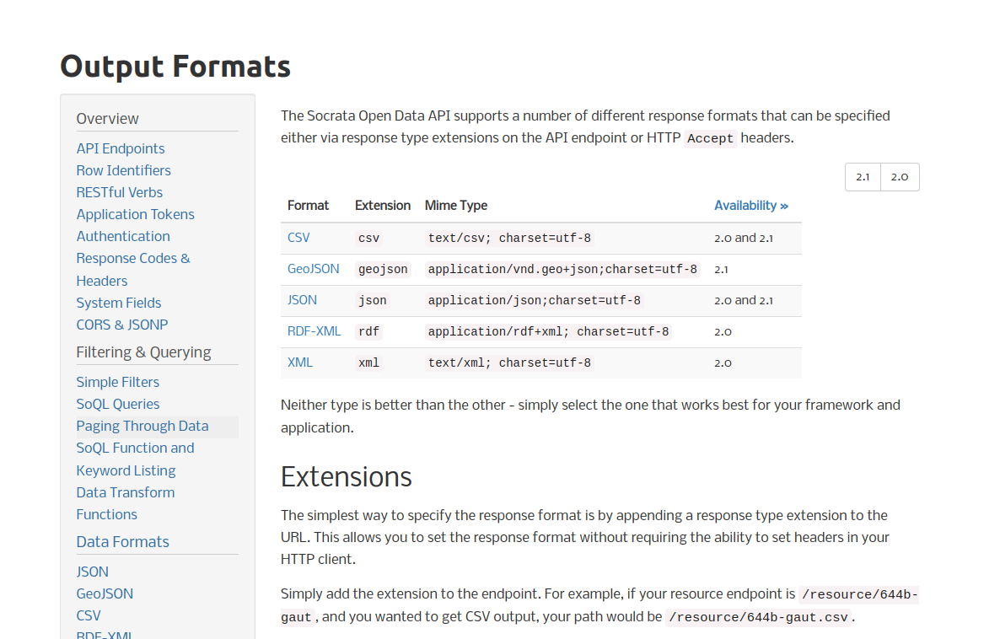
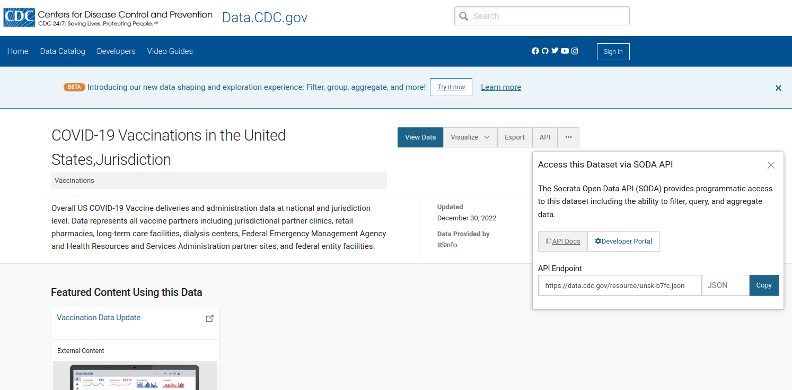

```{r setup, echo=FALSE, results="hide"}
suppressMessages({
suppressPackageStartupMessages({
library(teachCovidData)
library(ggplot2)
library(jsonlite)
library(DT)
})
})
```

# Introduction

The teachCovidData package includes snapshots of data
as a convenience to students and teachers.

Because the pandemic is ongoing, "up-to-date" data
are of considerable interest.

- Up-to-date records are important for identifying acute
developments.
- Unless strong real-time quality control procedures are
in place, up-to-date records may include misleading errors
that will take time to correct.

# Downloads from web sites

# Using APIs: formats and 'pagination'

Application Programming Interfaces (APIs) specify
how we can query resources on the web to obtain
data.  Usually it is sufficient to compose a URL
and use the URL with a "client" to trigger
delivery of data.  We will demonstrate this
in this section.

## Format options

The CDC provides APIs to COVID-related data using
products of a company called "Tyler".  Their
documentation of API usage and data formats can be
found [here](https://dev.socrata.com/docs/formats/index.html#,).

Heres' a snapshot of the documentation about data formats and 
API elements:



Notice the '2.1|2.0' in the upper right corner.  This is
indicative of availability of different _versions_ of the API.

It is very important to understand the "road map" of a
data provider or data consumption process.  Information
technology and data production methods are highly dynamic,
and producers and consumers need to be able to adapt
to changes.

## Using an API in R; pagination

The "API" button at the CDC download site for vaccine
data by jurisdiction produces a URL:



```{r lku}
library(jsonlite)
dat = fromJSON("https://data.cdc.gov/resource/unsk-b7fc.json")
dim(dat) # fromJSON simplifies when possible
datatable(dat[1:50,1:40]) # illustrative subset
```

We have received a data.frame by retrieving JSON using the CDC
data provider URL.  The fact that `dim(dat)` returns exactly
1000 "rows" is a hint that we have received only one "page"
of a larger resource.  This concept is discussed
in the [API documentation](https://dev.socrata.com/docs/paging.html).

We can reformulate the query to retrieve a larger collection of records. 

```{r lku2}
dat2 = fromJSON("https://data.cdc.gov/resource/unsk-b7fc.json?$limit=2000")
dim(dat2)
```

We have to be careful to avoid requesting unwieldy payloads from data providers.
Modifications to URLs that support filtering of resources are defined in
API documentation.
